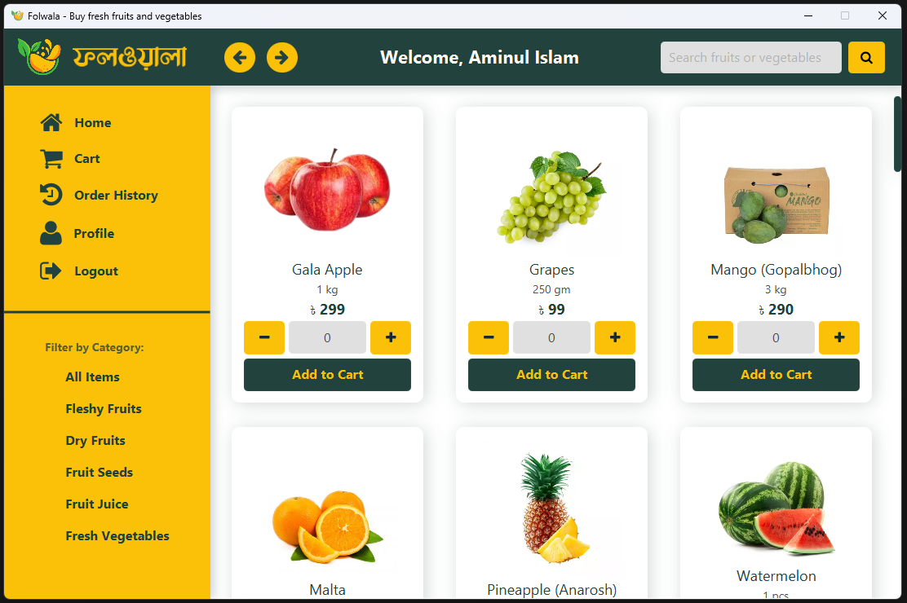
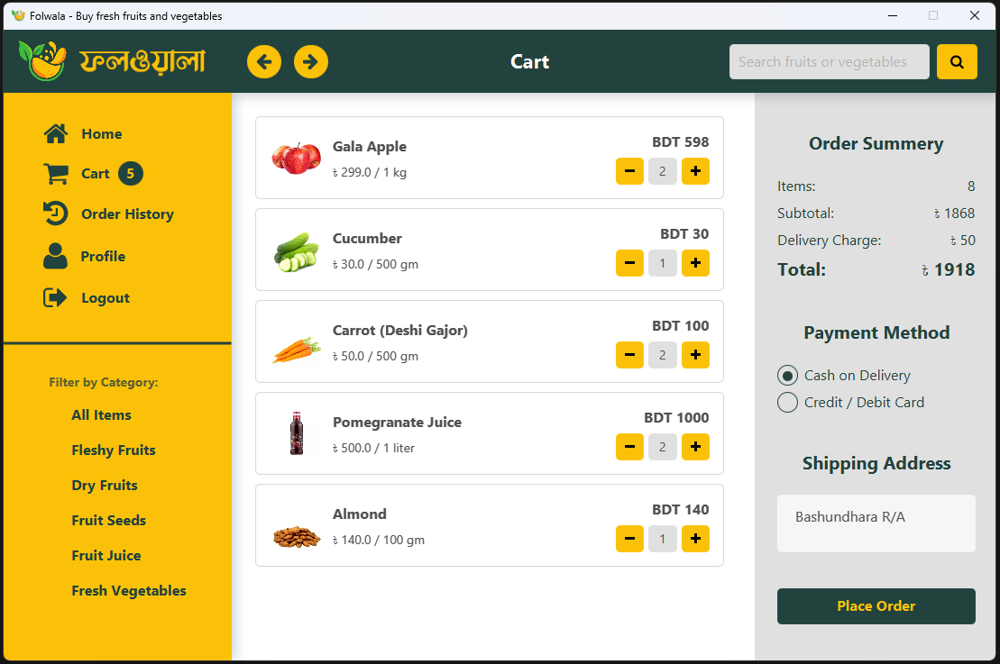
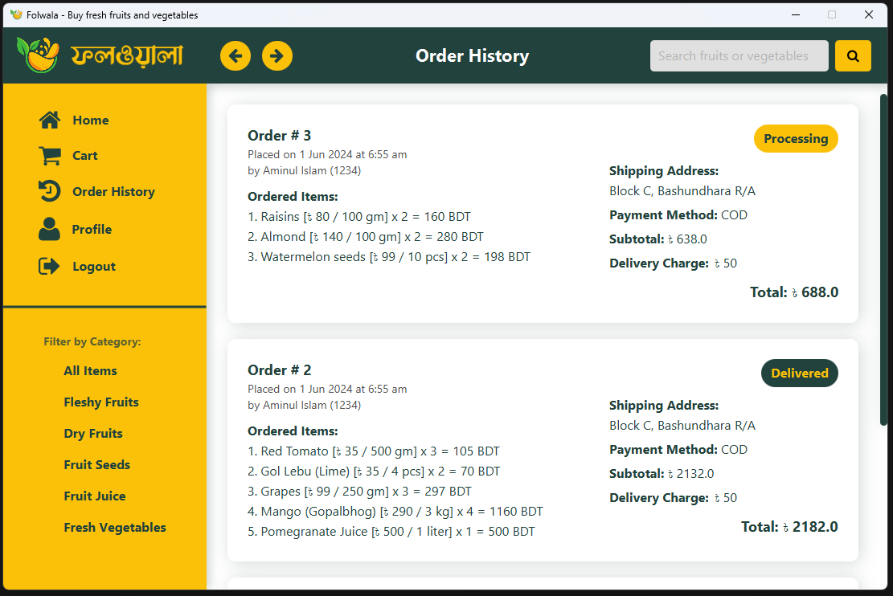
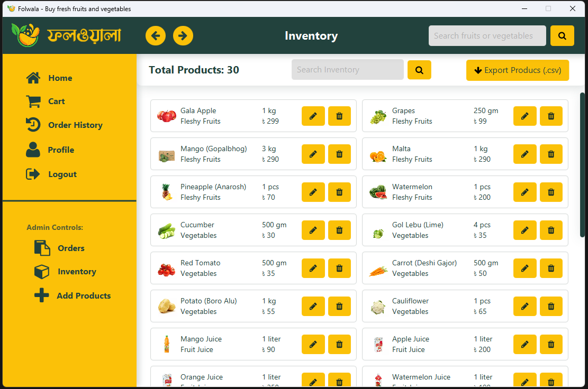
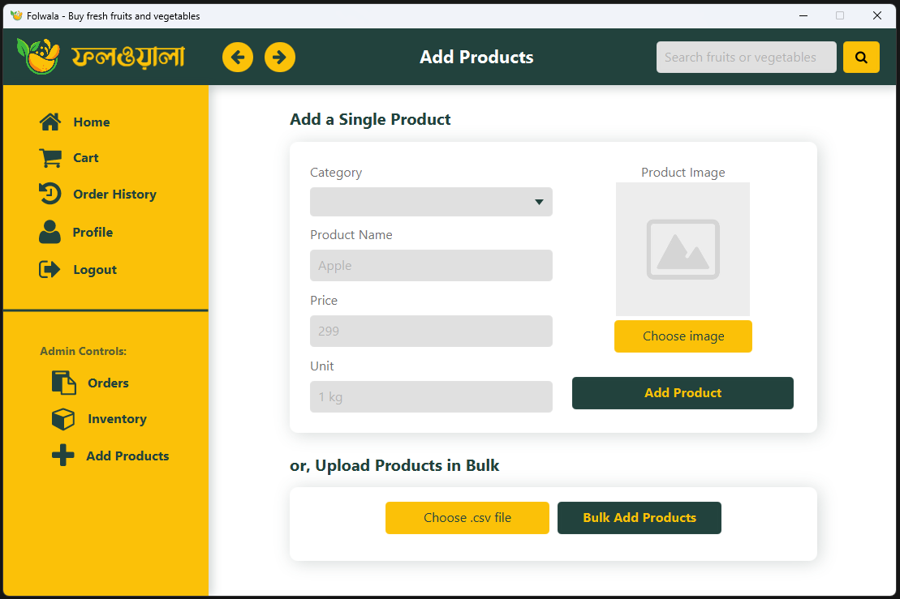
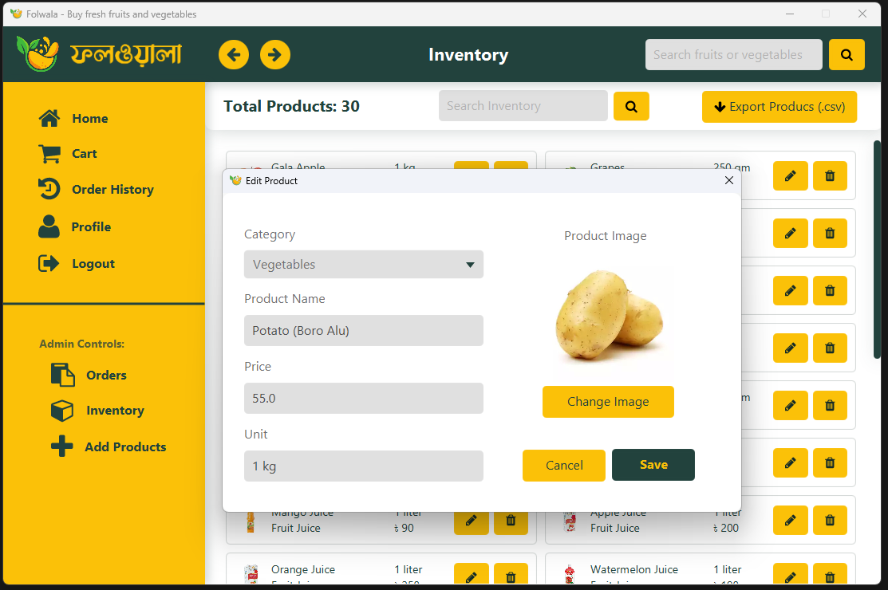

# Project Folwala

<p align="center">
  
  <br>
  
</p>

<p align="center">
    Folwala is an online shopping platform designed to provide a seamless shopping experience for fruits and vegetables. The platform connects users with a variety of fresh produce, eliminating the hassle of traditional shopping methods. This README file provides an overview of the project, its structure, installation instructions, and usage guidelines.
</p>

## Team Members

### Group 8

| Member |           Name           |     ID     |
| :----: | :----------------------: | :--------: |
| **1**  |       Aminul Islam       | 2321169042 |
| **2**  | Md. Shahriar Rakib Rabbi | 2321937642 |
| **3**  |   Tanvir Hossain Sakif   | 2232935642 |

## Course and Faculty

- **Course:** CSE215 (Section 7)
- **Semester:** Spring 2024 (North South University)
- **Faculty:** Dr. Mohammad Shifat-E-Rabbi

## Table of Contents

- [Project Overview](#project-overview)
- [Team Members](#team-members)
- [Course and Faculty](#course-and-faculty)
- [Introduction](#introduction)
- [System Architecture](#system-architecture)
- [Features](#features)
- [Classes and Their Responsibilities](#classes-and-their-responsibilities)
- [Installation and Running](#installation-and-running)
- [Usage](#usage)
- [Screenshots](#screenshots)
- [Conclusion](#conclusion)

## Introduction

Folwala aims to revolutionize the online shopping experience for fruits and vegetables. It provides a user-friendly interface where customers can browse, select, and purchase products with ease. The platform offers various features including user authentication, product management, cart management, order processing, and user account management.

## System Architecture

The system architecture of Folwala is based on the Model-View-Controller (MVC) pattern, ensuring a clear separation of concerns and modular design. Key components include:

- **Model**: Represents the data and business logic of the application. Classes such as `Cart`, `Order`, `Product`, and `User` encapsulate the core entities and functionalities.
- **View**: Handles the presentation layer of the application. Views are represented by FXML files and corresponding controllers such as `MainLayoutController`, `ProductListController`, and `CartController`.
- **Controller**: Acts as an intermediary between the model and view components, facilitating user interactions and business logic execution. Controllers such as `AuthenticationController`, `EditProductController`, and `OrderHistoryController` manage user inputs and application flow.

## Features

Folwala offers a range of features to enhance the shopping experience:

- **User Authentication**: Users can register and log in securely to access their accounts and manage personal information.
- **Product Management**: Admin users can add, edit, and delete products, while regular users can browse and purchase products.
- **Cart Management**: Users can add products to their carts, view cart items, and proceed to checkout for order placement.
- **Order Processing**: Users can place orders, view order history, and track order status.
- **Search and Filter**: Users can search for products based on keywords and filter products by category.

## Classes and Their Responsibilities

### 1. Cart and CartItem

- **Cart**: Manages the items added by a user, calculates the total price, and handles cart-related operations.
- **CartItem**: Represents an item in the cart, holding the product details and quantity.

### 2. Order and OrderItem

- **Order**: Manages the order details, including user information, order items, delivery status, and payment method.
- **OrderItem**: Represents an item in the order, holding the product details and quantity.

### 3. Product

- **Product**: Represents a product in the system with its details such as ID, name, unit, price, category, and image.

### 4. User

- **User**: Manages user information and authentication.

### 5. Services

- **CartService**: Handles cart-related operations such as loading, saving, and managing cart items.
- **OrderService**: Manages order processing, saving, and retrieval of orders.
- **ProductService**: Handles product management, including fetching, saving, deleting, and updating products.
- **UserService**: Manages user registration, login, logout, and session handling.

### 6. Controllers

- **AuthenticationController**: Manages user authentication processes including registration and login.
- **CartController**: Manages the cart view, updating order summary, and handling order placement.
- **OrderHistoryController**: Manages the display of order history for users.
- **AddProductsController**: Handles adding new products to the system.
- **EditProductController**: Manages editing existing product details.
- **MainLayoutController**: Manages the main layout of the application, including navigation and displaying different scenes.

## Installation and Running

1. **Download and Install JDK FX 22 or Above**

   - You can download it [from Azul](https://www.azul.com/downloads/?version=java-22&package=jdk-fx#zulu).

2. **Set Environment Variables**

   - Add the JDK installation path to your environment variables.

3. **Clone the Repository**
   ```sh
   git clone https://github.com/ShahriarRakibRabbi/Folwala-gui-ecom-cse215.git
   ```
4. **Run the Application**
   - For windows
     - You can directly run the `Folwala.exe` file from the root directory.
   - For other platforms
     - Run the application using the Folwala.jar file with the following command:
       ```sh
       java --enable-preview -jar Folwala.jar
       ```
     - This command works for Windows as well.

## Usage

### Default Credentials

When running the Folwala application locally, you can use the following default credentials for testing purposes:

- **Customer Account**:

  - Phone Number: 1234
  - Password: asdf

- **Admin Account**:
  - Phone Number: 123
  - Password: asdf

1. **Register and Login**: Users need to register and log in to access the platform.
2. **Browse Products**: Users can browse through different categories of products.
3. **Add to Cart**: Users can add products to their cart.
4. **Checkout**: Users can proceed to checkout and place orders.
5. **View Order History**: Users can view their order history and track the status of their orders.
6. **Admin Features**: Admin users can add, edit, and delete products from the inventory.

## Screenshots

### Home Page



### Cart



### Order History



### Admin - Inventory



### Admin - Adding Products



### Admin - Editing Products



## Conclusion

Folwala aims to revolutionize the online shopping experience for fruits and vegetables, offering a convenient and efficient platform for users to access fresh produce from the comfort of their homes. With its intuitive interface, robust features, and potential for future enhancements, Folwala is poised to become a leading player in the e-commerce industry.
